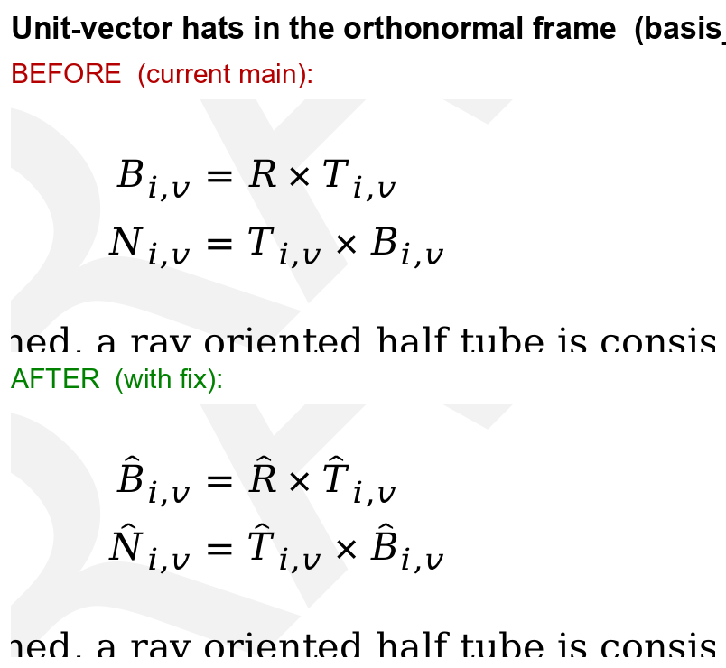
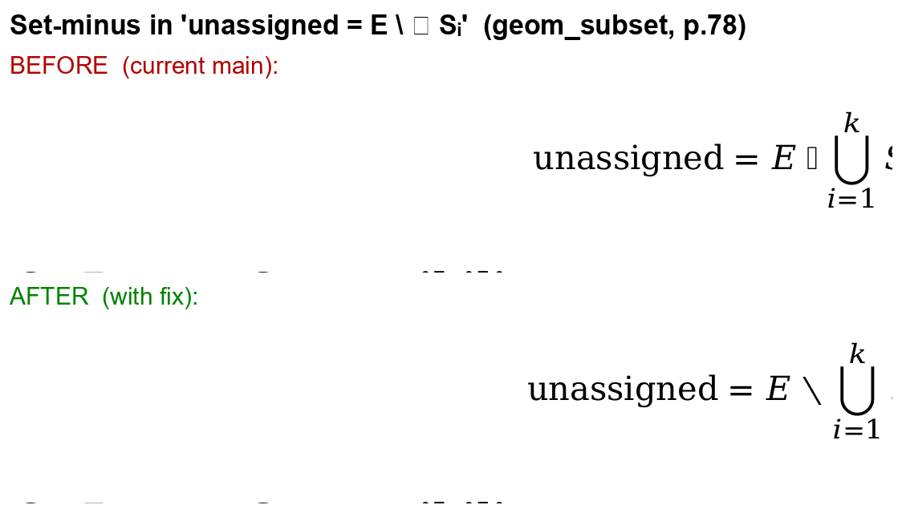

# Geometry voting-PDF: silent glyph corruption + a CI gate to catch it

Two classes of **silent** rendering corruption in the geometry voting PDF — the build
emitted *no error*, so they shipped unnoticed. Plus a doc_build CI gate so this can
never happen silently again.

WIP branches (CI green, not yet for merge):
- doc_build: `wip/glyph-fallback-and-ci-report` (`55bf9e5`)
- geometry-wg: `wip/glyph-render-fixes` → **draft PR #47**
- Relates to: geometry-wg **#45** (glyphs), **#42** (overflow), doc_build **#100** (gate)

---

## 1. Visual diff — what the reader sees in the PDF

### Unit-vector hats (basis_curves, §10.13.1, p.57)


The orthonormal-frame vectors lost their hats entirely: `B = R × T` instead of
`B̂ = R̂ × T̂`. This is *meaning-changing* — it reads as arbitrary vectors, not the
**unit** vectors the spec defines.

### Set-minus (geom_subset, §12.5.4, p.78)


`unassigned = E ∖ ⋃ Sᵢ` rendered with a blank tofu box where `∖` should be.

---

## 2. Root cause (corrects the original #45 assumption)

It is **not** a `\hat` problem — `\hat{}` renders fine everywhere. The two real causes:

| Symptom | Cause | Fix | Where |
|---|---|---|---|
| Hats dropped (99 warnings) | `\^{X}` — a **text-mode** caret accent — misused in math in `basis_curves.md`; the accent is silently dropped in math mode (and never renders inside `bmatrix`, where these appear) | `\^{X}` → `\hat{X}` (13 sites) | geometry **source** |
| Set-minus blank (21 warnings) | unicode-math maps `\setminus` → U+29F5, which **no** bundled math font has (DejaVuMathTeXGyre and latinmodern-math both lack it; tectonic ships only latinmodern-math.otf) | render as U+2216 (standard set-minus, which DejaVuMathTeXGyre has) | doc_build **engine** |

---

## 3. The CI gate (doc_build#100) — before vs. after

**Before:** doc_build's stderr filter *suppressed every* `Overfull \hbox` warning and let
`Missing character` warnings scroll past **without failing the build** — so both margin
overflow (#42) and dropped glyphs (#45) were invisible in CI.

```python
# old doc_builder.py — overflow silently dropped:
if line.startswith("warning: texput.") and ("Overfull " in line or "Underfull " in line):
    continue
```

**After:** overflow is **reported** (worst-first, non-fatal by default); dropped glyphs
**fail** the build. New flags: `--no-check-glyphs`, `--check-overflow`, `--overflow-threshold-pt`.

```
# default run (this is now in the geometry CI log, previously absent):
[doc_build] Right-margin overflow: 185 line(s) exceed the text width by >= 1.0pt (worst 172.3pt):
[doc_build] PDF diagnostics reported above (non-fatal).

# if a glyph is silently dropped -> build FAILS:
[doc_build] Missing glyphs (silently dropped from the PDF): 42 warning(s) [U+29F5 x42]
[doc_build] PDF quality gate failed (aousd/doc_build#100):
  - 42 missing-glyph warning(s) -- characters were silently dropped from the PDF

# opt-in: fail on overflow too (--check-overflow):
[doc_build] PDF quality gate failed (aousd/doc_build#100):
  - 185 line(s) overflow the right margin by >= 1.0pt
```

Default = **fail-on-dropped-glyph, report-on-overflow** (keeps geometry CI green while the
#42 wide-math overflow stays deferred to voting). The worst overflows (172pt, 121pt) are the
known #42 wide-math that runs off the page.

---

## 4. For the WG / Oleksiy — decisions

1. **doc_build PR (the gate + set-minus fix)** touches *every* spec's CI → needs maintainer
   review + a policy call on defaults/threshold. Should missing-glyph be a hard fail for all
   specs (recommended)? Default overflow threshold (currently 1.0pt; honest but ~185 lines —
   noisy from RaggedRight + wide math)?
2. **geometry source fix (`\^`→`\hat`)** is a straightforward correctness fix.
3. **#42 overflow itself** is unchanged here — the gate only *surfaces* it; the reformat
   (ISO single-letter vs. layout) remains a voting-period decision.
